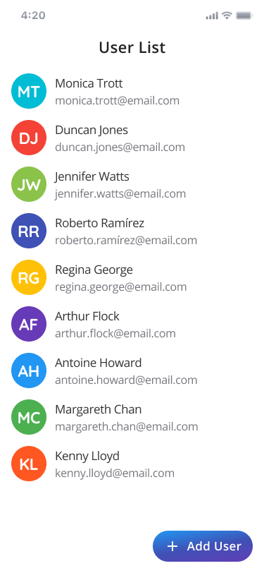

# frontend-internship-test

Hi! If you came here, this means you was approved in our first trials. Congratulations!

The next step is described below in a little development test to analyze your development skills. Since this is a internship test, you'll be evaluated mostly on your good practice skills and knowledge of the basics of the Flutter framework. Good luck!

## What you need to do

Create a simple flutter mobile application with the specifications [on this figma link](https://www.figma.com/file/f7mAdy2IS1vaoOx3gaFCfq/Internship-Test?node-id=0%3A1). This application *must* have:

  

1. Screen with a list of users
2. A register user screen
3. A user details screen

The attention on design patterns and definitions on figma will be a *plus*.

You can check the figma prototype of the app [in this link](https://www.figma.com/proto/f7mAdy2IS1vaoOx3gaFCfq/Internship-Test?node-id=8%3A331&scaling=min-zoom)

## Rules and tips

You can check the rules [here](https://www.figma.com/file/f7mAdy2IS1vaoOx3gaFCfq/Internship-Test?node-id=32%3A2)

## About the submition

After you finish the test, you can send a email to **rafael@qwkin.io** with the your repository link on github. A feedback with the good points and improvement points about your code will be provided for you after some analysis.
